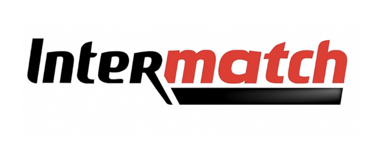

# Intermatch – Wine, Cheese & Dish Pairing App

**Find the perfect wine and cheese pairings for any dish.**

---

## 🚀 Access the App

- [Launch Intermatch](https://intermatch.fr)

---

## 📄 Documentation

- [Cumulative Weekly Reports](./documents/management/weekly_reports/cumulative.md)
- [Functional Specification](Documents/FunctionalSpecifications/FunctionalSpecification.md)
- [Technical Specification](Documents/TechnicalSpecifications/TechnicalSpecification.md)
- [Test Plan](Documents/TestPlan/TestPlan.md)
- [User Manual](Documents/UserManual/UserManualIntermatch.pdf)
- [Project Gantt, KPIs, and Schedules (Excel)](Documents/Management/Bubble_Project_Team7.xlsx)

---

## 🛠️ Main Features

- Smart dish, wine, and cheese search with optimized names
- Instant product filtering and category browsing
- Save and manage favorites
- Personalized recommendations for each dish
- Multi-language support (French / English)
- Responsive UI for mobile and desktop

---

