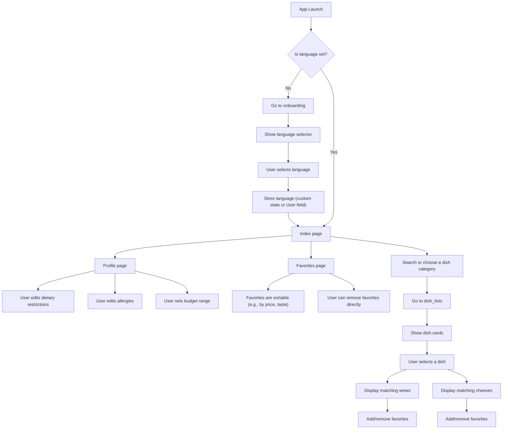

# Technical Specification

## Table of Contents

<strong>(click to expand)</strong>

 

1. [Introduction](#1-introduction)  
   1.1 [Technical Overview](#11-technical-overview)

2. [Bubble Implementation](#2-bubble-implementation)  
   2.1 [Pages](#21-pages)  
   2.2 [Reusable Elements](#22-reusable-elements)  
   2.3 [Workflows](#23-workflows)  
   2.4 [Styles](#24-styles)  
   2.5 [Custom States](#25-custom-states)  
   2.6 [Product Display (Cards)](#26-product-display-cards)  
    2.6.1 [Wine Card](#261-wine-card)  
    2.6.2 [Cheese Card](#262-cheese-card)  
    2.6.3 [Dish Card](#263-dish-card)  
    2.6.4 [Favorites Logic](#264-favorites-logic)  
     
    2.7 [Language Handling](#27-language-handling)   
    2.8 [Installed Plugins](#28-installed-plugins)  

3. [Data Base Structure](#3-data-base-structure)  
   3.1 [Products](#31-products)  
   3.2 [User](#32-user)

4. [Conventions](#4-conventions)  
   4.1 [On GitHub](#41-on-github)  
   4.2 [On Bubble](#42-on-bubble)  
    4.2.1 [Page Naming](#421-page-naming)  
    4.2.2 [Repeating Group Naming](#422-repeating-group-naming)  
    4.2.3 [Element Naming](#423-element-naming)  
    4.2.4 [Workflow Naming](#424-workflow-naming)

5. [Navigation Flow](#5-navigation-flow)

## 1. Introduction

This project was commissioned by the Intermarché of Saint-Rémy-de-Provence. The goal is to help the customers to choose which wine and cheese would be the best fit for the dish they plan to cook. This application is being made on Bubble and will focus on delivering an intuitive user experience, highlighting local products, and showing well-matched options at different price points.

---

## 1.1 Technical Overview

Search, filters, and dynamic recommendations will be handled through a combination of search boxes, dropdowns, and custom states. Repeating groups will be used to display filtered lists of products based on user input and preferences. Option sets will be used for tags like allergies, dietary restrictions, or taste profiles, which makes filtering both more reliable and easier to update. Reusable elements will be used for anything that appears across several pages, like navigation bars or product cards, to keep things clean and consistent.

---

## 2. Bubble Implementation

### 2.1 Pages 
The application will be structured across several pages to improve performance and simplify team collaboration. Each of them will focus on a different task or user goal, which will help for clarity. 

The planned pages include:

- `index`: Homepage where users are welcomed and guided to begin the process. It contains the primary entry point for selecting a dish and starting the recommendation flow.
- `dish_lists`: Displays wine and cheese suggestions, grouped by category.
- `favorite`: Lets users view and manage the products they labelled as favorite.
- `profile`: Allows users to update preferences such as dietary restrictions, allergies, and language.
- `onboarding`: Guides new users through initial preferences setup.
- `404`: This page will appear if the user tries to go to an non-existing page or destination.

---

### 2.2 Reusable Elements

To keep the project modular and easy to maintain, several parts of the UI have been implemented as Reusable Elements. These are used across multiple pages to ensure consistency, avoid logic duplication, and simplify updates.

The following elements are implemented as reusables:

- `TopNavbar` and `BottomNavbar`  
  Global navigation components adapted for desktop and mobile breakpoints.

- `wineCards`, `cheeseCards`, `dishRowCards`  
  Dedicated product card components displaying wine, cheese, or dish items dynamically. Each is tied to a repeating group and styled consistently.

- `SearchBar` and `SearchResults`  
  A reusable combination used to perform searches and display autocomplete results in real-time.

- `LanguageDropdown`  
  Handles language selection across the app. Connected to Option Sets and custom states to dynamically switch all translatable UI elements.

Each of these reusables is configured for responsiveness and contains its own internal logic (e.g. favorite toggle, filters). 

---

### 2.3 Workflows

Workflows handle all interactions and logic within the application — from navigation and filtering to dynamic content updates and UI state changes.

To keep workflows clean, readable, and easy to debug:

- Complex logic is broken down into smaller workflows.
- Each workflow follows a camelCase naming convention: `eventActionResult`
- Redundant steps are avoided by reusing actions wherever possible (e.g. conditional toggles).

#### 2.3.1 Workflow Categories

The application groups workflows into several key categories:

- Navigation
  - Example: `buttonClickGoToProfile` → Navigates to the profile page
  - Back buttons and in-app links also use conditional redirects if needed

- Search & Filtering
  - Example: `searchBarInputUpdateResults` → Filters a repeating group based on user input
  - Works in tandem with custom states to preserve selected filters

- Favorites Management
  - Example: `heartClickAddToFavorites` / `heartClickRemoveFromFavorites`
  - Updates the `Current User`’s list of favorite products
  - Favorites are toggled directly in reusable card components

- Language Switching
  - Example: `dropdownLanguageChangeUpdateText`
  - Stores the selected language in a custom state or user field
  - Triggers dynamic re-rendering of all translatable text

- Custom State Updates
  - Example: `dropdownSelectSetCategoryState`
  - Updates custom state values for filtering, UI display, or content visibility
  - Often paired with a final “Apply” button to trigger the actual data source update

#### 2.3.2 Best Practices

- Each workflow is labeled clearly to reflect its purpose and the UI element it’s tied to.
- Conditional logic (`Only when...`) is used to prevent unnecessary executions.
- Reusables contain self-contained workflows to reduce page-level clutter.
- All workflows are reviewed for side effects when updating multiple data sources or UI elements.

---
 
### 2.4 Styles

To ensure consistency and maintainability in the design, all UI components will be styled using Bubble's built-in styles page. No inline styles will be used unless required for dynamic conditional logic. This will allow us to (if needed) update the entire app theme from one place.

---

### 2.5 Custom States

Custom states will be used to store temporary values that do not need to be saved to the database, which will be ideal for controlling UI behavior such as toggling elements or, tracking selected filters.  They also should be added directly to the element they control, rather than to the page or unrelated containers. This keeps the logic easy to understand, limits unwanted side effects, and makes future changes easier.

---

### 2.6 Product Display (Cards)

Wine, cheese, and dish products are displayed using three dedicated reusable elements: `wineCards`, `cheeseCards`, and `dishRowCards`. Each of them contains a repeating group sorted by product type, with a consistent card layout showing relevant product details.

---

#### 2.6.1 Wine Card

| **Property**               | Dynamic Source                                                                 | Style / Settings                                                     |
|------------------------|--------------------------------------------------------------------------------|-----------------------------------------------------------------------|
| **Card dimensions**    | 145 × 330 px                                                                    | Min-width 145px / Max-width 185px Min-height 0 / Max-height 330 px  |
| **Responsive widths**  | `<768px` → 140px (screen width)  | `≤992px` → 215px  | `>992px` → 210px                                   |
| **Product image**      | `Parent group's Product's image`                                               | 65 × 205 px, Zoom rendering                                          |
| **Year**               | `Parent group's Product's year`                                                | Arial 12px, weight 400                                                |
| **Name**               | `Parent group's Product's name`                                                | Montserrat 16px, weight 800, color `#231918`                          |
| **Technical details**  | `origin`, `wine_type`, `volume_or_weight`, `price_per_liter_or_kg` (rich text) | Arial 12px, weight 400, color `#231918`, line-spacing 1.4             |
| **Price**              | `Parent group's Product's price`                                               | Montserrat 26px, weight 800                                           |
| **Favorite icon**      | Two overlapping MaterialIcons (35 × 35 px)                                     | Bottom-right (absolute position)                                     |
| •`favorite_outline`   | Visible when Current User’s `favorites` **does not** contain the product       | on-click → “Add to favorites”                                        |
| • `favorite`           | Visible when Current User’s `favorites` **does** contain the product           | on-click → “Remove from favorites”                                   |

---

#### 2.6.2 Cheese Card

| **Property**                | Dynamic Source                                             | Style / Settings                     |
|-------------------------|-------------------------------------------------------------|---------------------------------------|
| **Card dimensions**     | 230 × 305 px                                                | Fixed width & height                  |
| **Product image**       | `Parent group's Product's image`                           | Aspect-fit                            |
| **Label badges**        | RepeatingGroup on `List of Tags` (e.g. Local, blue cheese) | Inline-flex badges, margin-right 4px  |
| **Name**                | `Parent group's Product's name`                            | Montserrat 16px, weight 800           |
| **Description**         | `Parent group's Product's description`                     | Arial 12px, weight 400, color #231918 |
| **Weight & unit price** | `volume_or_weight` + `" | "` + `price_per_liter_or_kg`      | Arial 12px, weight 400                |
| **Price**               | `Parent group's Product's price`                           | Montserrat 26px, weight 800           |
| **Favorite icon**       | Same logic as Wine                                          | 35 × 35 px, bottom-right              |

---

#### 2.6.3 Dish Card

| Property               | Dynamic Source                          | Style / Settings               |
|------------------------|------------------------------------------|--------------------------------|
| **Card dimensions**    | 135 × 290 px                             | Fixed width & height           |
| **Product image**      | `Parent group's Product's image`        | Cover, full-width              |
| **Dish name**          | `Parent group's Product's name`         | Montserrat 16px, weight 800    |
| **Favorite icon**      | Same logic as Wine & Cheese             | 35 × 35 px, bottom-right       |

----

#### 2.6.4 Favorites Logic

This will be shared across all the cards

- **Add to favorites**:  
  Trigger → icon `favorite_outline`  
  Action → “Make changes to Current User” → `favorites add Current cell's Product`

- **Remove from favorites**:  
  Trigger → icon `favorite`  
  Action → “Make changes to Current User” → `favorites remove Current cell's Product`

---

### 2.7 Language Handling

Language preferences are handled manually using a combination of custom states and option sets.

- Supported languages are defined in the `Languages` Option Set (e.g. `French`, `English`, `Spanish`).
- A custom state `selected_language` is used to store the user's selection.
- Translations are managed through a `WebsiteText` Option Set, which holds one field per language.
- UI text is dynamically set using expressions such as:  
  `WebsiteText's title's selected_language`.
- The language selector is embedded in the `navbar` reusable element and available on every page.
- English is used as the default fallback if no match is found.

----

### 2.8 Installed Plugins

| Plugin Name                          | Purpose                                                                 |
|-------------------------------------|-------------------------------------------------------------------------|
| Google Material Icons               | Used to display standard icons such as favorites (heart), search, etc. |
| Orchestra (Repeating Group Addon)   | Enables advanced control over Repeating Group items (e.g., syncing UI).|
| Progress Bar                        | Used for the price slider in the Profile page.                         |
| Toolbox                             | Allows for custom JavaScript expressions.|

---

### 2.9 Offline User Experience

This section outlines how the application behaves when the user has no internet connection. The goal is to ensure essential features remain accessible and the user experience is not disrupted unnecessarily.

#### 2.9.1 Feature Availability

| Feature                     | Online | Offline | Notes |
|----------------------------|--------|---------|-------|
| Search (popular items)     | ✅     | ✅      | Limited to cached items |
| Search (full database)     | ✅     | ❌      | Requires online access |
| Recipe categories          | ✅     | ❌      | Not cached |
| Product recommendations    | ✅     | ✅      | Cached from recent sessions |
| Favorites (view/manage)    | ✅     | ✅      | Stored in local storage |
| Product details            | ✅     | ✅      | Partial display, some images may be missing |
| Profile settings           | ✅     | ✅      | Changes saved locally and synced later |
| Language switching         | ✅     | ✅      | Option sets are cached after initial load |

#### 2.9.2 Offline Indicators and Behavior

- An offline status banner is displayed when the app detects a loss of connection.
- Pages or actions that require online data are disabled with a tooltip or message explaining their unavailability.
- Cached content displays a note such as "Content last updated on [date]" if applicable.

#### 2.9.3 Local Storage and Syncing

- Favorites and user preferences are stored using Bubble’s built-in local storage mechanism.
- The most frequently accessed product data is cached and used for display during offline sessions.
- Upon reconnection:
  - Any profile changes made offline are synced automatically.
  - Favorites are reconciled with the server.
  - Cached content is refreshed in the background.
---

## 3. Data Base Structure

The app will use a structured data model to store and manage the different types of products (dishes, wines, cheeses), as well as user preferences. The data base will be designed to allow fast filtering, personalized suggestions, and compatibility with features such as favorites, allergy filters, or local product highlighting.

### 3.1 Products 

This type will be used for every physical product — dish, wine, or cheese — displayed in the app. Each entry will include product metadata, pricing, origin, tags for filtering, and store-related info.

**Name:** Product  
**Fields:**
- `name` (text): The product name  
- `description` (text): Short or detailed product description  
- `image` (image): Visual used in product cards and detail views  
- `origin` (text): Region or country of origin (used to highlight local items)  
- `price` (number): Price in euros  
- `volume_or_weight` (text): Format such as 75cl or 200g  
- `price_per_liter_or_kg` (text): Calculated price per standard unit  
- `type` (ProductType - OptionSet): Used to distinguish between dishes, wines, and cheeses
- `is_alcohol` (yes / no): Whether the product is alcoholic or not  
- `is_expert_pick` (yes / no): Used to highlight selected recommendations  
- `store_location` (text): Indicates where the product can be found in the store
- `taste_notes` (List of TasteNote): Fruity, Spicy, Earthy...  
- `allergy_tags` (List of Allergy): Useful for hiding incompatible products  
- `diet_tags` (List of DietaryRestriction): Vegan, Vegetarian, etc. 
- `wine_year` Year of wine production (empty for cheeses). 

---

### 3.2 User

Stores user preferences for language, budget, dietary restrictions, and favorites.

| Field               | Type                          | Multiple Entries | Description                                   |
|--------------------|-------------------------------|------------------|-----------------------------------------------|
| `first_name`       | text                          | No               | Optional user name for personalization        |
| `email`            | text                          | No               | Optional email (used only for future exports) |
| `language`         | Languages (Option Set)        | No               | Preferred language for UI                     |
| `budget_per_bottle`| number                        | No               | Max budget preference for wine                |
| `allergies`        | List of Allergy               | Yes              | Active allergy preferences                    |
| `diet_preferences` | List of DietaryRestriction    | Yes              | Vegan, Vegetarian, etc.                       |
| `favorites`        | List of Products              | Yes              | User-saved products                           |
| `search_history`   | List of text or Dishes        | Yes              | Last searched dishes (max 6)                  |

--- 

## 4. Conventions

### 4.1 On GitHub
 
- All files and folders should be named in PascalCase.
- Technical, Functional and Management documentation should be in their own dedicated folder in a ./documents folder.
- Images should be in an ./image subfolder from where they are called.
- GitHub branches should be named in kebab-case.

### 4.2 On Bubble

To maintain consistency and reliability during development, the following naming and structuring conventions must be followed across all pages, elements, workflows, custom states, and styles in the Bubble application.

####  4.2.1 Page Naming

Each page must be named using **snake_case**, describing the content or structure it displays.

**Examples:**
- `home_page`
- `dish_lists`
- `search_results`
- `profile_settings`

---

#### 4.2.2 Repeating Group Naming

Repeating groups must follow the format: rg_function

Where:
- `rg` stands for repeating group
- `function` describes the content or role

**Examples:**
- `rg_productList`
- `rg_filteredResults`
- `rg_userFavorites`

---

#### 4.2.3 Element Naming

All the elements must follow the following convention: type_function_index

Where:
- `type` = element type (e.g., `button`, `group`, `input`, `icon`)
- `function` = what it does or represents
- `index` = optional number for disambiguation

**Examples:**
- `button_popup_2`
- `group_mailInput`
- `input_dishSearch`

The point is to avoid names such as `Text A` or `Group B`.

---
#### 4.2.4 Workflow Naming

Workflows must be written using *camelCase.* They must be short, action-oriented and clearly describe what the workflow does. 

Here is the needed format: `eventActionResult`

Where:
- `event` = the trigger (button click, page load)
- `action` = the main behavior
- `result` = what the outcome is, if needed for clarity

The goal is to avoid vague names such as `workflow1` or `popupLogic`. 

## 5. Navigation Flow

## Glossary

| Term                  | Definition                                                                 |
|-----------------------|----------------------------------------------------------------------------|
| **Bubble**            | No-code platform used to build the entire application through visual logic. |
| **Custom State**      | Temporary value stored on an element or page, used to control UI or workflows without saving to the database. |
| **Repeating Group**   | Element that displays a dynamic list of items based on data source and filters. |
| **Workflow**          | Sequence of actions triggered by an event like a button click or page load. |
| **Option Set**        | Predefined list of values used for filtering, tagging, or displaying dynamic content. |
| **Reusable Element**  | UI component reused across pages (e.g., navbar, product card) for consistency. |
| **Responsive Engine** | Layout system in Bubble that adapts elements based on screen size. |
| **Toolbox Plugin**    | Plugin that enables use of custom JavaScript inside Bubble workflows. |
| **localStorage**      | Browser-based storage used to retain values like selected language across sessions. |
| **Material Icons**    | Icon set used in the app for actions such as favoriting or searching. |
| **Orchestra Plugin**  | Plugin that improves control over Repeating Group item updates and interaction. |