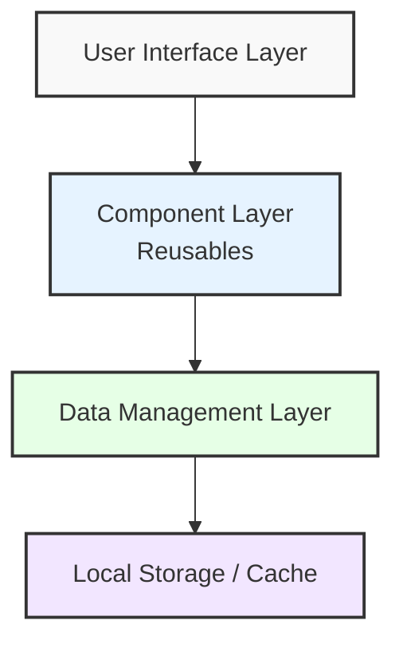
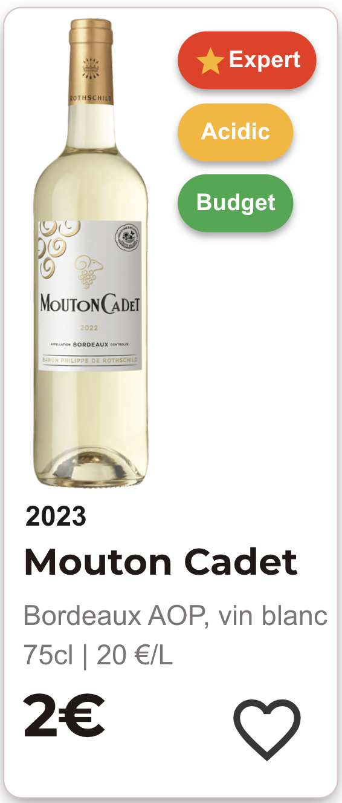
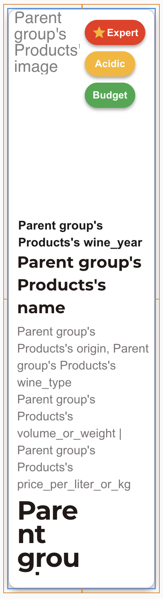
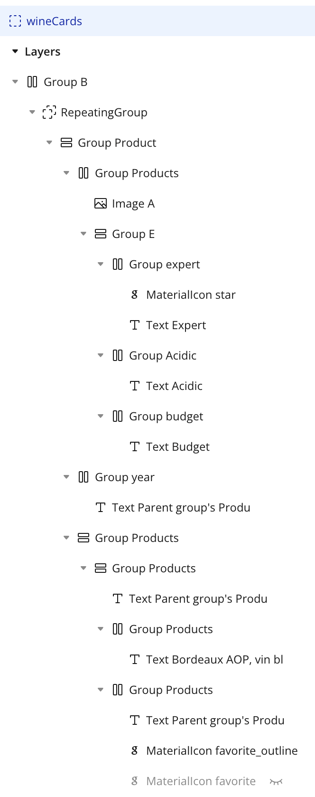
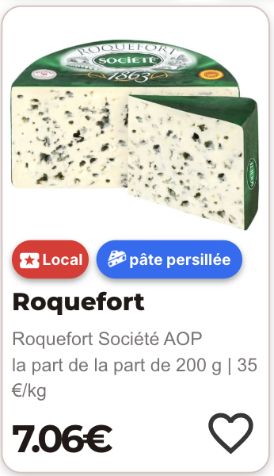
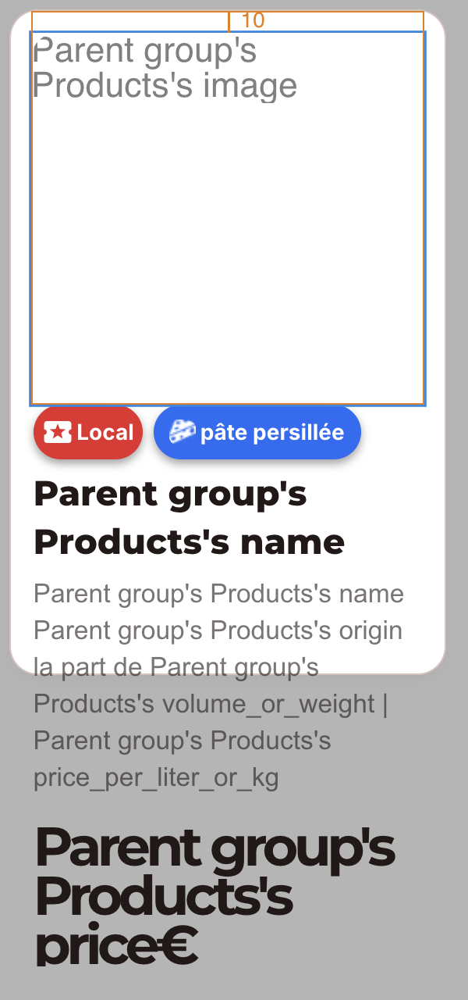
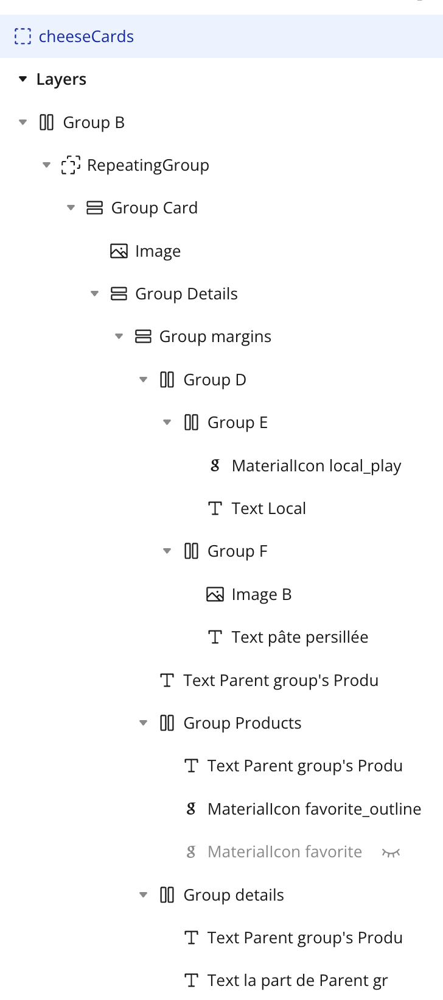
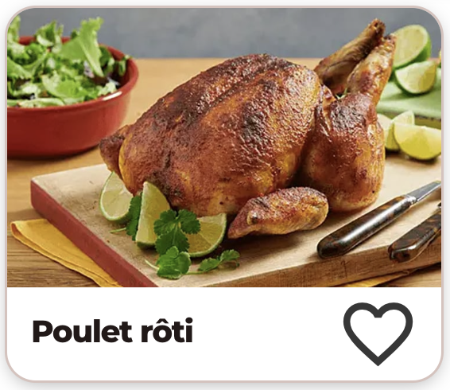
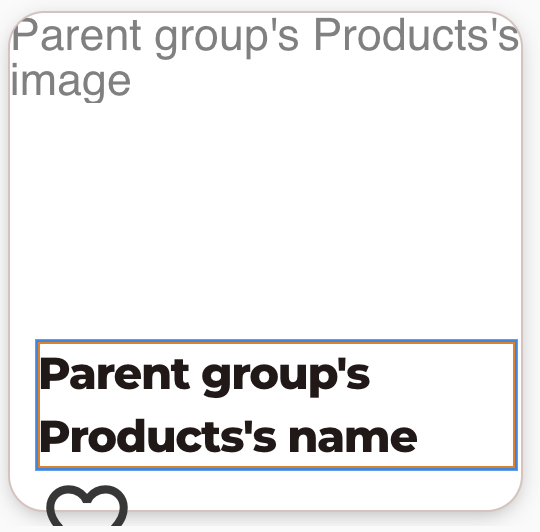
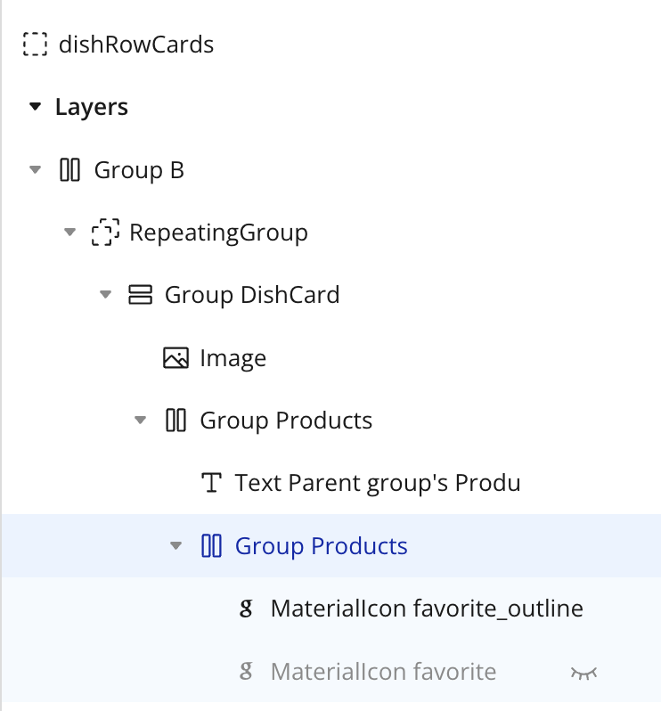

# Technical Specifications - Intermarché Wine & Cheese Recommendation App

## Table of Contents
1. [Introduction](#1-introduction)
2. [System Architecture](#2-system-architecture)
3. [Technology Stack](#3-technology-stack)
4. [Data Model](#4-data-model)
5. [User Interface Components](#5-user-interface-components)
6. [Page Components](#6-page-components)
7. [Reusable Components](#7-reusable-components)
8. [Navigation System](#8-navigation-system)
9. [Offline Functionality](#9-offline-functionality)
10. [Performance Requirements](#10-performance-requirements)
11. [Security and Privacy](#11-security-and-privacy)
12. [Testing Strategy](#12-testing-strategy)
13. [Deployment and Maintenance](#13-deployment-and-maintenance)

---

## 1. Introduction

### 1.1 Purpose of the Document
This technical specification document defines the implementation details for the Intermarché wine and cheese recommendation application. It serves as a comprehensive guide for developers, testers, and maintainers, translating functional requirements into technical solutions.

### 1.2 Scope
This document covers the front-end implementation of the application using Bubble.io, including:
- User interface components and their interactions
- Data structures and relationships
- Navigation and routing logic
- Offline functionality implementation
- Performance optimization strategies

### 1.3 Assumptions and Dependencies
- Development platform: Bubble.io (no-code platform)
- Target devices: iOS (12.0+) and Android (5.0+)
- Initial data source: CSV files (future API integration planned)
- Network connectivity: Partial offline functionality required

---

## 2. System Architecture

### 2.1 High-Level Architecture
### 2.1 High-Level Architecture



The application follows a layered architecture:

1. **User Interface Layer**: Handles all user interactions and display components
2. **Component Layer**: Contains reusable Bubble.io elements that compose the interface
3. **Data Management Layer**: Manages application data, filtering, and business logic
4. **Local Storage/Cache**: Handles persistent storage for offline functionality

### 2.2 Component Hierarchy
```
App
├── Navigation Components
│   ├── TopNavbar (reusable)
│   └── BottomNavbar (reusable)
├── Page Components
│   ├── index (Homepage)
│   ├── recommendation (Meal/Ingredient recommendations)
│   ├── dish_lists (Recipe categories)
│   ├── favorite (Favorites management)
│   ├── profile (User preferences)
│   ├── onboarding (Initial setup)
│   └── 404 (Error page)
└── Reusable UI Components
    ├── Product Cards (Wine, Cheese, Dish)
    ├── Search Components
    └── Form Components
```

### 2.3 Data Flow
**[TODO: Add data flow diagrams and descriptions]**

---

## 3. Technology Stack

### 3.1 Development Platform
- **Primary**: Bubble.io
- **Deployment**: Web app with mobile-responsive design
- **Database**: Bubble's built-in database

### 3.2 External Dependencies
### 3.2 External Dependencies

#### 3.2.1 APIs and Services
- **Express.js API**: Custom REST API for product data retrieval
    - Endpoint: `/api/products` for fetching product information
    - Authentication: API key in request header
    - Rate limiting: 100 requests per minute

#### 3.2.2 UI Components
- **Google Material Icons**: Icon system for UI elements
    - Implementation: Web font integration
    - Version: Latest stable
    - Usage: Navigation, actions, status indicators

#### 3.2.3 Third-Party Libraries
- **Bubble.io Plugins**:
    - API Connector (for Express.js integration)

### 3.3 Browser Compatibility
### 3.3 Browser Compatibility

| Browser | Minimum Version | Notes |
|---------|----------------|-------|
| Chrome | 60+ | Full functionality supported |
| Safari | 12+ | Offline storage limited to 50MB |
| Firefox | 60+ | Full functionality supported |
| Edge | 79+ (Chromium-based) | Full functionality supported |
| Opera | 47+ | Full functionality supported |
| iOS Safari | 12+ | PWA installation supported |
| Android Chrome | 60+ | Full functionality supported |
| Samsung Internet | 8.2+ | Full functionality supported |


---

## 4. Data Model

### 4.1 Database Schema
*(Referenced from existing data model document)*

#### 4.1.1 Products Table
| Field | Type | Description | Constraints |
|-------|------|-------------|-------------|
| name | text | Product name | Required |
| description | text | Product description | Optional |
| image | image | Product image | Optional |
| origin | text | Product origin | Optional |
| price | number | Price in € | Required |
| volume_or_weight | text | Volume or weight | Optional |
| price_per_liter_or_kg | text | Unit price | Optional |
| type | ProductType | Dish/Wine/Cheese | Required |
| is_alcohol | yes/no | Alcoholic product flag | Default: no |
| is_expert_pick | yes/no | Expert recommendation flag | Default: no |
| store_location | text | In-store location | Optional |
| taste_notes | List of TasteNote | Flavor profiles | Multiple |
| allergy_tags | List of Allergy | Allergy information | Multiple |
| diet_tags | List of DietaryRestriction | Dietary info | Multiple |
| wine_type | text | Wine classification | Optional |
| cheese_type | text | Cheese classification | Optional |
| wine_year | text | Production year | Optional |
| recommended_cheeses | List of Products | Related cheeses | Multiple |
| recommended_dishes | List of Products | Related dishes | Multiple |
| recommended_wines | List of Products | Related wines | Multiple |
| main_meat | text | Primary protein | Optional |
| dish_category | DishCategory | Recipe category | Optional |

#### 4.1.2 User Table
| Field | Type | Description | Constraints |
|-------|------|-------------|-------------|
| first_name | text | User's first name | Optional |
| email | text | User's email | Optional |
| language | Languages | UI language | Default: French |
| budget_per_bottle | number | Max price preference | Optional |
| allergies | List of Allergy | User allergies | Multiple |
| diet_preferences | List of DietaryRestriction | Dietary preferences | Multiple |
| favorites | List of Products | Saved products | Multiple |
| search_history | List of text | Recent searches | Max 6 items |

#### 4.1.3 Option Sets

### 🍽️ `ProductType`
- Dish
- Cheese
- Wine

### 🧂 `TasteNote`
- Fruity
- Spicy
- Earthy
- Creamy
- Acidic
- Nutty

### 🗂️ `DishCategory`
- Seasonal Recipes
- Regional Specialties
- Trending
- Low-Budget

### ⚠️ `Allergy`
- Nuts
- Gluten
- Dairy
- Eggs
- Soy
- Shellfish

### 🚫 `DietaryRestriction`
- Vegetarian
- Vegan
- Dairy-free
- Gluten-free

### 🌍 `Languages`
- English
- Français

### 4.2 Data Relationships
**[TODO: Add relationship diagrams and explanations]**


---

## 5. User Interface Components

### 5.1 Design System
- **Typography**: Montserrat (headings), Arial (body text)
- **Color Palette**: 
  - Primary: `#E3151A` (Intermarché red)
  - Secondary: `#231918` (dark gray)
- **Spacing**: 4px grid system
- **Border radius**: Standard rounded corners

### 5.2 Responsive Breakpoints
| Breakpoint | Width | Target Device |
|------------|-------|---------------|
| Mobile | < 768px | Smartphones |
| Tablet | 768px - 992px | Tablets |
| Desktop | > 992px | Desktop/Laptop |

### 5.3 Component Specifications
**[TODO: Detail each UI component's specifications]**

---

## 6. Page Components

### 6.1 index (Homepage)
**Purpose**: Main entry point for users to start their wine and cheese discovery journey.

#### 6.1.1 Components
- Search bar with autocomplete
- Recipe category cards
- Search history display
- Top navigation bar
- Bottom navigation bar (mobile only)

#### 6.1.2 Layouts
**Desktop Layout**:
- Header with logo, search, and navigation links
- Main content area with search prominently displayed
- Category cards in grid layout
- Search history below main search

**Mobile Layout**:
- Simplified header with logo and search
- Stacked category cards
- Bottom navigation bar
- Search history integrated into search interface

#### 6.1.3 User Interactions
- Search input triggers autocomplete suggestions
- Category selection navigates to dish_lists page
- Search history items redirect to recommendation page
- Navigation elements route to respective pages

#### 6.1.4 State Management
**[TODO: Define state variables and their management]**

#### 6.1.5 Error Handling
- Empty search results: "No results matching your search"
- Offline mode: Disable category browsing, show offline indicator

---

### 6.2 recommendation (Meal/Ingredient Screen)
**Purpose**: Display selected meal/ingredient with wine and cheese pairing recommendations.

#### 6.2.1 Components
- Product header with image and description
- Two-rows layout (wine recommendations | cheese recommendations)
- Product cards with expert pick highlighting
- Back navigation
- Favorites functionality

#### 6.2.2 Layouts
**Desktop Layout**:
- Full-width header with meal information
- Side-by-side wine and cheese rows
- 3 products per row in card format

**Mobile Layout**:
- Stacked header information
- Single row with wine section above cheese section
- Cards adapted for mobile width

#### 6.2.3 User Interactions
- Product card tap navigates to product detail page
- Favorite button adds/removes products from user favorites
- Back button returns to previous page

#### 6.2.4 Recommendation Logic
**[TODO: Define how recommendations are filtered and displayed]**

#### 6.2.5 Expert Pick Highlighting
- Visual distinction with orange accent color
- "Our experts recommendation" label
- Positioned prominently within each column

---

### 6.3 dish_lists (Recipe Categories)
**Purpose**: Display recipes within selected categories (seasonal, regional, trending, low-budget).

#### 6.3.1 Components
- Category header with title and description
- Recipe grid/list with images and names
- Back navigation
- Category filtering (if applicable)

#### 6.3.2 Layouts
**[TODO: Define responsive layouts for recipe listings]**

#### 6.3.3 User Interactions
- Recipe selection navigates to recommendation page
- Category switching (if multiple categories displayed)

#### 6.3.4 Offline Behavior
- Categories greyed out when offline
- Display message: "This feature is not available offline"

---

### 6.4 favorite (Favorites Management)
**Purpose**: Allow users to view and manage their saved products.

#### 6.4.1 Components
- Favorites header
- Product list with removal functionality
- Empty state handling
- Search/filter within favorites (future enhancement)

#### 6.4.2 Layouts
**[TODO: Define layouts for favorites display]**

#### 6.4.3 User Interactions
- Product tap navigates to detail page
- Remove button deletes from favorites
- Bulk actions (future enhancement)

#### 6.4.4 Local Storage
- Favorites stored locally for offline access
- Sync with user account when online

---

### 6.5 profile (User Preferences)
**Purpose**: Manage user settings including dietary restrictions, allergies, and language preferences.

#### 6.5.1 Components
- Profile header
- Dietary restrictions checkboxes
- Allergy selection interface
- Budget range slider
- Language selection dropdown
- Save/cancel buttons

#### 6.5.2 Form Validation
**[TODO: Define validation rules for user inputs]**

#### 6.5.3 Data Persistence
- Settings stored locally
- Applied to all recommendation filtering

---

### 6.6 onboarding (Initial Setup)
**Purpose**: Guide new users through initial app setup and preference configuration.

#### 6.6.1 Onboarding Flow
1. Welcome screen with language selection
2. Dietary restrictions setup
3. Allergy preferences
4. Budget range configuration
5. Completion confirmation

#### 6.6.2 Skip Options
**[TODO: Define which steps can be skipped]**

#### 6.6.3 Progress Indicators
- Step counter (e.g., "2 of 4")
- Progress bar visual
- Next/Previous navigation

---

### 6.7 404 (Error Page)
**Purpose**: Handle navigation to non-existent pages gracefully.

#### 6.7.1 Components
- Error message
- Suggested actions
- Navigation back to homepage
- Optional search functionality

#### 6.7.2 Error Scenarios
- Invalid URLs
- Deleted product pages
- Expired links

---

## 7. Reusable Components

### 7.1 Product Cards

> **Scope**: Unified definition for the three product card types (Wine, Cheese, Dish), covering dynamic data bindings, styles, dimensions, responsive rules, and "favorites" workflows.

#### 7.1.1 General Structure (Web Reusable Elements)

Each card type is implemented as a **Reusable Element**:
- **wineCards**: RepeatingGroup filtered `type = Wine`  
- **cheeseCards**: RepeatingGroup filtered `type = Cheese`  
- **dishRowCards**: RepeatingGroup filtered `type = Dish`  

Inside each reusable:
1. A **RepeatingGroup** (Type of content = Products)  
2. A **Group Card** styled via the overridden `Card` style  

#### 7.1.2 Wine Cards (`wineCards`)

<div align="row">
  
  
  
</div>

**Technical Specifications**:

| Property | Dynamic Source | Style / Settings |
|----------|----------------|------------------|
| **Card dimensions** | — | 145 × 330 px |
| **Product image** | `Parent group's Product's image` | 65 × 205 px, run-mode rendering: Zoom |
| **Label badges** | RepeatingGroup on `Parent group's Product's taste_notes` | Inline-flex badges, margin-right 4 px |
| **Expert badge** | `Parent group's Product's is_expert_pick` (yes/no) | Red pill-shaped badge with star icon, Montserrat 14 px 600, color `#E63946` |
| **Year** | `Parent group's Product's wine_year` | Arial 12 px, weight 400 |
| **Name** | `Parent group's Product's name` | Montserrat 16 px, weight 800 |
| **Wine type** | `Parent group's Product's wine_type` | Arial 12 px, weight 400, color `#231918` |
| **Technical details** | `Parent group's Product's origin`, `volume_or_weight`, `price_per_liter_or_kg` | Arial 12 px, weight 400, color `#231918`, line-spacing 1.4 |
| **Price** | `Parent group's Product's price` | Montserrat 26 px, weight 800 |
| **Favorite icon** | Two overlapping MaterialIcons (outline & filled) | 35 × 35 px, positioned bottom-right (absolute) |
| • `favorite_outline` | Visible when Current User's `favorites` **does not** contain the Product | on-click → "Add to favorites" workflow |
| • `favorite` | Visible when Current User's `favorites` **does** contain the Product | on-click → "Remove from favorites" workflow |

**Responsive Breakpoints**:
| Breakpoint | Min Width |
|------------|:---------:|
| `< 768px` (Mobile) | 140px |
| `≥ 768px & ≤ 992px` (Tablet) | 215px |
| `> 992px` (Desktop) | 210px |

#### 7.1.3 Cheese Cards (`cheeseCards`)

<div align="row">
  
  
  
</div>

**Technical Specifications**:

| Property | Dynamic Source | Style / Settings |
|----------|----------------|------------------|
| **Card dimensions** | — | 230 × 305 px |
| **Product image** | `Parent group's Product's image` | Aspect-fit |
| **Label badges** | RepeatingGroup on `Parent group's Product's taste_notes` | Inline-flex badges, margin-right 4 px |
| **Name** | `Parent group's Product's name` | Montserrat 16 px, weight 800 |
| **Cheese type** | `Parent group's Product's cheese_type` | Arial 12 px, weight 400, color `#231918` |
| **Description** | `Parent group's Product's description` | Arial 12 px, weight 400, color `#231918` |
| **Weight & unit price** | `Parent group's Product's volume_or_weight` + " \| " + `Parent group's Product's price_per_liter_or_kg` | Arial 12 px, weight 400 |
| **Price** | `Parent group's Product's price` | Montserrat 26 px, weight 800 |
| **Favorite icon** | Two overlapping MaterialIcons (outline & filled) | 35 × 35 px, positioned bottom-right (absolute) |
| • `favorite_outline` | Visible when Current User's `favorites` **does not** contain the Product | on-click → "Add to favorites" workflow |
| • `favorite` | Visible when Current User's `favorites` **does** contain the Product | on-click → "Remove from favorites" workflow |

**Responsive Breakpoints**:
| Breakpoint | Min Width |
|------------|:---------:|
| `< 768px` (Mobile) | 175px |
| `≤ 992px` (Tablet & Desktop) | 185px |

#### 7.1.4 Dish Cards (`dishRowCards`)

<div align="row">
  
  
  
</div>

**Technical Specifications**:

| Property | Dynamic Source | Style / Settings |
|----------|----------------|------------------|
| **Card dimensions** | — | 215 × 230px |
| **Product image** | `Parent group's Product's image` | Cover, full-width |
| **Dish name** | `Parent group's Product's name` | Montserrat 16px, weight 800 |
| **Favorite icon** | Same logic as Wine & Cheese | 35 × 35 px, bottom-right |

**Responsive Breakpoints**:
| Breakpoint | Min Width |
|------------|:---------:|
| `< 768px` (Mobile) | 140px |
| `≤ 992px` (Tablet) | 215px |

#### 7.1.5 Favorites Workflows

**Add to favorites**:
- **Trigger**: MaterialIcon `favorite_outline` is clicked  
- **Action**: "Make changes to Current User" → **`favorites add Current cell's Product`**

**Remove from favorites**:
- **Trigger**: MaterialIcon `favorite` is clicked  
- **Action**: "Make changes to Current User" → **`favorites remove Current cell's Product`**

> These workflows live inside each Reusable's Group Card.

### 7.2 Navigation Components

#### 7.2.1 TopNavbar
**Usage**: Desktop and mobile header navigation  
**Visibility**: shown on Home & Favorites; hidden on Profile when viewport ≥ 768px

**Layout & Dimensions**:
| Property | Value |
|----------|-------|
| Height | 80 px |
| Horizontal padding | 40 px each side |
| Safe-area top inset | 24 px (iOS) |

**Components & Responsive Rules**:
| Layer | Element | Visible when |
|-------|---------|--------------|
| **Logo** | Image_desktop | viewport ≥ 768 px |
| | Image_mobile | viewport < 768 px |
| **Language** | Dropdown (flag) | always |
| **Search** | SearchBox | on Home or Favorites pages |
| | Overlay (Group L) | when SearchBox value is non-empty |
| **Links** | Home, Favorites, Profile text | viewport ≥ 768 px |

**Active Link State**:
- Reads URL parameter `?home=yes`, `?favorite=yes`, or `?profile=yes`
- **Active**: color `#E3151A` (red)
- **Inactive**: color `#231918` (black)

**Workflows**:
1. **SearchBox value changes** → Search `Products` where `name contains SearchBox's value` → display in RepeatingGroup
2. **When RepeatingGroup is visible** → show Overlay (Group L)
3. **When RepeatingGroup is hidden** → hide Overlay
4. **Overlay (Group L) clicked** → hide RepeatingGroup and Overlay
5. **Language Dropdown changed** → update `Current User.language` = Dropdown's value

#### 7.2.2 BottomNavbar
**Usage**: Mobile-only bottom navigation  
**Visibility**: shown on all pages when viewport < 768 px; TopNavbar links hidden on mobile

**Layout & Dimensions**:
| Property | Value |
|----------|-------|
| Height | 80 px |
| Horizontal padding | 20 px each side |

**Components**:
| Item | Icon | Label | Action |
|------|------|-------|--------|
| **Home** | `home` MaterialIcon | Home | Go to index?home=yes |
| **Favorites** | `favorite` MaterialIcon | Favorites | Go to favorite?favorite=yes |
| **Profile** | `supervised_user_circ` MaterialIcon | Profile | Go to profile?profile=yes |

**Active State Logic**:
- URL parameter detection (?home=yes, ?favorite=yes, ?profile=yes)
- Visual highlighting with brand color `#E3151A`
- Clicking an item navigates with its URL parameter set to "yes"

### 7.3 Search Components
**[TODO: Define search input, autocomplete, and results components]**

### 7.4 Form Components
**[TODO: Define form inputs, buttons, and validation components]**

---

## 8. Navigation System

### 8.1 URL Structure
```
/ (homepage)
/recommendation?dish=[dish_id]
/dish_lists?category=[category_name]
/favorite
/profile
/onboarding
/404
```

### 8.2 Navigation Flow
**[TODO: Create navigation flow diagrams]**

### 8.3 Back Button Behavior
- Browser back button support
- In-app back navigation
- Breadcrumb navigation (where applicable)

### 8.4 Deep Linking
**[TODO: Define deep linking strategy for specific products/dishes]**

---

## 9. Offline Functionality

### 9.1 Caching Strategy
#### 9.1.1 Data to Cache
- 100 most popular ingredients/dishes
- All wine and cheese products (basic info)
- User favorites (complete data)
- User preferences and settings
- Essential UI strings for selected language

#### 9.1.2 Cache Management
- Initial data download on first app launch
- Periodic cache updates when online
- Cache size limitations and cleanup strategies

### 9.2 Offline User Experience
#### 9.2.1 Feature Availability
| Feature | Online | Offline |
|---------|--------|---------|
| Search (popular items) | ✅ | ✅ |
| Search (all items) | ✅ | ❌ |
| Recipe categories | ✅ | ❌ |
| Product recommendations | ✅ | ✅ (cached only) |
| Favorites | ✅ | ✅ |
| Product details | ✅ | ✅ (cached, no images) |
| Profile settings | ✅ | ✅ |

#### 9.2.2 Offline Indicators
- Persistent offline status indicator
- Feature-specific offline messages
- Visual cues for disabled functionality

### 9.3 Data Synchronization
**[TODO: Define sync strategy for when connection is restored]**

---

## 10. Performance Requirements

### 10.1 Loading Time Targets
- Homepage: < 2 seconds on 4G connection
- Page transitions: < 1 second
- Offline content: Instant loading
- Image loading: Progressive with placeholders

### 10.2 Optimization Strategies
#### 10.2.1 Image Optimization
- Multiple resolution versions
- Lazy loading implementation
- WebP format support with fallbacks
- Placeholder images for offline mode

#### 10.2.2 Data Loading
- Pagination for large product lists
- Incremental loading of search results
- Background prefetching of likely-needed data

### 10.3 Memory Management
**[TODO: Define memory usage limits and cleanup strategies]**

### 10.4 Battery Optimization
**[TODO: Define strategies to minimize battery drain]**

---

## 11. Security and Privacy

### 11.1 Data Protection
- GDPR compliance requirements
- Local data encryption for sensitive information
- Minimal data collection principle

### 11.2 User Privacy
- Optional user registration
- Local storage of preferences
- No tracking without consent

### 11.3 Security Measures
**[TODO: Define security protocols for data transmission and storage]**

---

## 12. Testing Strategy

### 12.1 Unit Testing
**[TODO: Define unit testing approach for Bubble.io components]**

### 12.2 Integration Testing
**[TODO: Define integration testing for component interactions]**

### 12.3 User Acceptance Testing
**[TODO: Define UAT scenarios and acceptance criteria]**

### 12.4 Performance Testing
**[TODO: Define performance testing methodology]**

### 12.5 Offline Testing
**[TODO: Define offline functionality testing procedures]**

---

## 13. Deployment and Maintenance

### 13.1 Deployment Strategy
**[TODO: Define Bubble.io deployment process]**

### 13.2 Environment Configuration
- Development environment setup
- Staging environment for testing
- Production environment specifications

### 13.3 Monitoring and Analytics
**[TODO: Define monitoring tools and KPIs]**

### 13.4 Maintenance Procedures
- Regular data updates
- Performance monitoring
- User feedback integration
- Bug fix deployment process

### 13.5 Future Enhancements
- API integration roadmap
- Additional language support
- Enhanced offline capabilities
- Advanced recommendation algorithms

---

## Appendices

### Appendix A: Bubble.io Specific Implementation Notes
**[TODO: Add platform-specific implementation details]**

### Appendix B: Design Assets and Brand Guidelines
**[TODO: Reference design files and brand compliance requirements]**

### Appendix C: Data Migration Plan
**[TODO: Define plan for transitioning from CSV to API data sources]**

### Appendix D: Accessibility Requirements
**[TODO: Define accessibility standards and implementation]**

---

*This document is a living specification that will be updated as development progresses and requirements evolve.*
